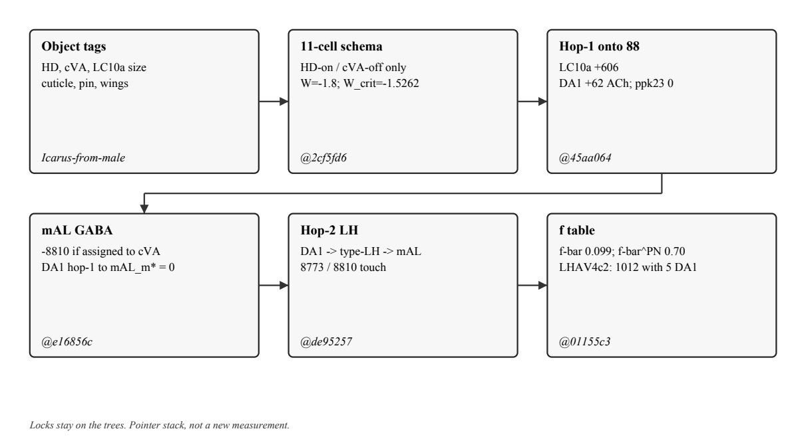

# fly_icarus chain: note

Locks stay on the trees. Index: gist [12835f74](https://gist.github.com/martialsystems/12835f747d6360781f3cc7f91f243178). Object of study for `fly_icarus` is constrained toy dynamics on named types. Hop-1 trees from `fly_p1_sign` onward are connectome measurements. Falsifier on the 11-cell slice: condition 3 not matching condition 1 when HD-on / cVA-off.

## Abstract

Question: does a male P1 slice treat a frozen Icarus-from-male as a female? Icarus-from-male keeps male wiring. The object is fat, wingless, and grounded.

On an 11-cell published-sign row, condition 3 matches condition 1 when 7,11-HD is on and cVA is off. Schema `W_crit = -1.5262`. Template `W[P1, DA1] = -1.8`. `@2cf5fd6`.

Hop-1 signed counts onto 88 pC1-coexpress cells: LC10a +606, DA1 +62 ACh, HD -3, ppk23 0. `hd_on_cva_off_ns` is false. 3 tracks 1 on LC10a. `@45aa064`.

mAL GABA onto those 88 is -8810. Folded onto the cVA slot, that dump is past `W_crit`. DA1 hop-1 onto `mAL_m*` is 0. Numbers `@e16856c`. Sentence `@41437dc`.

DA1 reaches 90 of the 93 mAL GABA IDs at hop-2 through type-LH (8773 of 8810). Hop-1 DA1 onto those IDs is 3 of 8810. `@de95257`.

On the 161 LH cells in that hop, f-bar is 0.099 of all input and 0.703 of uniglomerular PN input. LHAV4c2 carries 1012 of 3301 LH-to-mAL synapses with 5 DA1 synapses. `@01155c3`.

`--unfreeze`, `--female-brain-icarus`, and `--n 1000` stay stubbed.

## 1. Question

Does a male P1 slice treat a frozen Icarus-from-male as a female?

Icarus-from-male keeps male wiring. The object is fat, wingless, grounded.

## 2. Locks

**Schema.** 11-cell published-sign row. 3 matches 1 when 7,11-HD is on and cVA is off. Fat, wingless, pinned contact, and female cuticle leave DA1 in place. Schema `W_crit = -1.5262` on the 3d pin. Template `W[P1, DA1] = -1.8`. Song bouts = 1: latch on at step 36, dt = 0.05. `@2cf5fd6`, `logs/p1_contact_s1.json`, `logs/p1_da1_dose_s1.json`.

**Hop-1 map.** Same battery, MaleCNS hop-1 onto 88 pC1-coexpress cells. LC10a +606. DA1 +62 acetylcholine. HD -3. ppk23 0. ORN_DA1 to DA1 PN is +32,016. Direct ORN to P1 is 0. Every row sings. 3 tracks 1 (`d31 = 0.0`) because both objects drive LC10a. 3b P1 is 0.9421, above condition 1. `hd_on_cva_off_ns` is false. Seeds 2 and 3 match. `@45aa064`, `logs/p1_sign_s1.json`.

**mAL dump.** Hop-1 GABA from type-mAL onto those 88 is -8810. Folded into `W[P1, DA1]` on the parent LC10a scale, the cVA slot is -25.9842, past parent `W_crit = -1.539`. DA1 hop-1 onto `mAL_m*` is 0; onto two mALB1 cells it is 96 ACh. `hd_on_cva_off_ns` is true on that folded row because the slot was given -25.9842. Numbers `@e16856c`, `logs/p1_mal_s1.json`. Sentence `@41437dc`.

**Drive.** The 93 mAL GABA cells that make the -8810: DA1 hop-1 hits one mALB1 (45 ACh, 3 of 8810). Type-LH hop-1 hits 93 of 93. DA1 onto type-LH that hit those 93: 161 cells, 8425. Those 161 onto the 93: 3301, covering 90 cells and 8773 of 8810. Hop: `DA1_PN -> type-LH -> mAL_GABA_pre`. On this tree, DA1-driven means any DA1 synapse (`f_i > 0`). `@de95257`, `logs/drive_s1.json`.

**Fraction.** Frozen 161 IDs from `@de95257`. Count in: DA1 onto those 161 is 8425. Count out: those 161 onto the 93 is 3301. Incoming weight by pre tag: other 155,526, LH 72,266, other_uPN 33,072, multi_PN 19,140, DA1_PN 8,425, mAL 4,234. f-bar = 0.099172 (all incoming). f-bar^PN = 0.702674 (uniglomerular PNs). LHAV4c2: 2 cells, 1012 of 3301, 5 DA1 synapses, f-bar 0.002537, f-bar^PN 1.0 (5/5). LH007m: 814 of 3301, 1714 DA1, f-bar^PN 0.728904. LH008m: 360 of 3301, 2851 DA1, f-bar^PN 0.73711. `@01155c3`, `logs/lh_frac_s1.json`.

## 3. Stubbed flags

`--unfreeze`, `--female-brain-icarus`, and `--n 1000` stay stubbed on every tree in this chain.

## 4. Replay

Each lock is one extract plus, where a battery exists, the frozen-object assay.

| Tree | Extract | Lock |
|------|---------|------|
| fly_icarus | `data/templates/male_p1.json` | `logs/p1_contact_s1.json`, `logs/p1_da1_dose_s1.json` |
| fly_p1_sign | `scripts/extract_p1_weights.py` | `logs/p1_sign_s1.json` |
| fly_p1_mal | `scripts/extract_p1_weights.py` | `data/templates/extract.json`; do not restamp `logs/p1_mal_s1.json` |
| fly_mal_drive | `scripts/extract_drive.py` | `logs/drive_s1.json` |
| fly_lh_frac | `scripts/extract_frac.py` | `logs/lh_frac_s1.json`; IDs in `data/frozen/ids.json` |

How to run: in each tree, `.venv/bin/python -m pytest`. Rebuilds, where allowed, are the extract scripts above. Do not overwrite the listed lock files.

## 5. Repo table

| Tree | SHA | Allowed sentence | Lock file |
|------|-----|------------------|-----------|
| [fly_icarus](https://github.com/martialsystems/fly_icarus) | `2cf5fd6` | In this 11-cell slice, HD-on / cVA-off is necessary and sufficient for 3 matching 1. Morphology, pin, and feminized cuticle are not. Schema W_crit=-1.5262. | `logs/p1_contact_s1.json` |
| [fly_p1_sign](https://github.com/martialsystems/fly_p1_sign) | `45aa064` | Hop-1 DA1 is +62 ACh. LC10a +606. ppk23 hop-1 is 0. hd_on_cva_off_ns is false. | `logs/p1_sign_s1.json` |
| [fly_p1_mal](https://github.com/martialsystems/fly_p1_mal) | `e16856c` | Hop-1 mAL GABA onto these 88 is large enough to pass W_crit if assigned to cVA. DA1 hop-1 onto mAL_m* is 0; onto two mALB1 cells it is 96 ACh. | `logs/p1_mal_s1.json` |
| fly_p1_mal sentence | `41437dc` | Same allowed sentence as the row above. | README of fly_p1_mal |
| [fly_mal_drive](https://github.com/martialsystems/fly_mal_drive) | `de95257` | Yes at hop-2. DA1 hop-1 is 3 of 8810. DA1-driven type-LH accounts for 8773 of 8810. Hop: DA1_PN -> type-LH -> mAL_GABA_pre. | `logs/drive_s1.json` |
| [fly_lh_frac](https://github.com/martialsystems/fly_lh_frac) | `01155c3` | f-bar=0.099172. f-bar^PN=0.702674. LHAV4c2 carries 1012 of 3301 with 5 DA1 synapses. | `logs/lh_frac_s1.json` |

Figure 1 (`figures/stack.png`): object tags to the 11-cell row to hop-1 counts to hop-2 LH to the f table.

## Sources (2026-09-20)

Records checked on Crossref, 2026-09-20. Female parent count is FlyWire. Male hop-1 counts are MaleCNS. The 11-cell row is a published-sign schema, not a hop-count extract.

Berg, S., Beckett, I. R., Costa, M., Schlegel, P., Januszewski, M., Marin, E. C., Nern, A., et al. (2026). Sexual dimorphism in the complete Drosophila male central nervous system connectome. Cell, 189(18), 5504-5526.e15. https://doi.org/10.1016/j.cell.2026.08.015

Dorkenwald, S., Matsliah, A., Sterling, A. R., Schlegel, P., Yu, S. C., McKellar, C. E., Lin, A., et al. (2024). Neuronal wiring diagram of an adult brain. Nature, 634(8032), 124-138. https://doi.org/10.1038/s41586-024-07558-y

Index (pointers only): https://gist.github.com/martialsystems/12835f747d6360781f3cc7f91f243178
